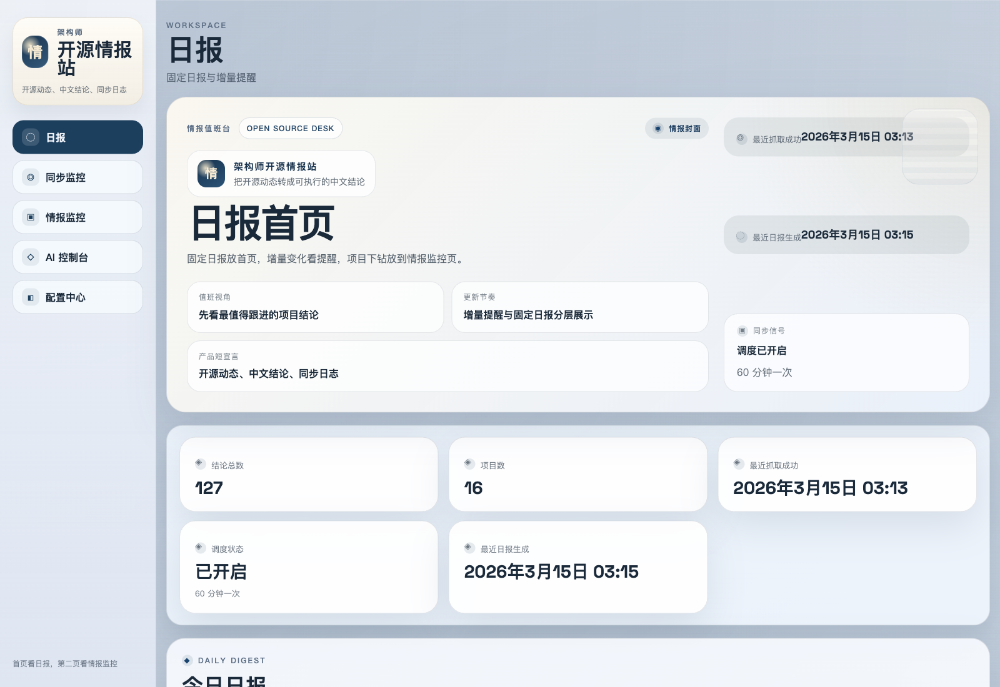
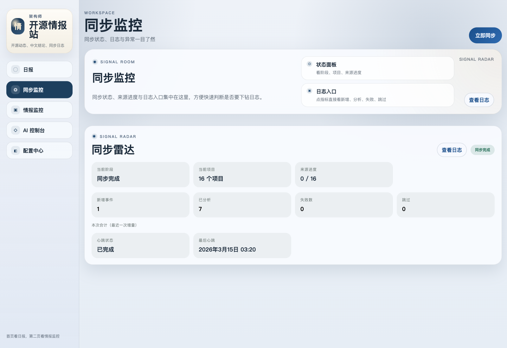
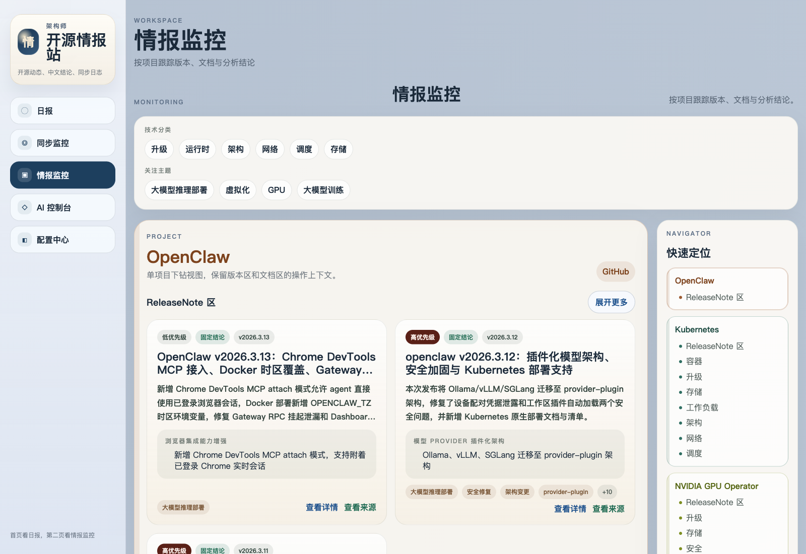
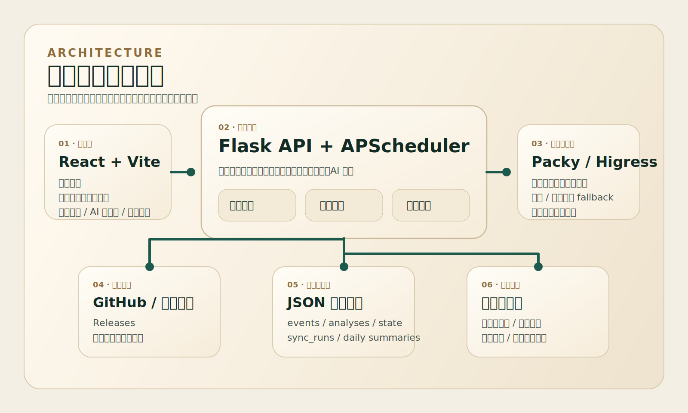

# 架构师开源情报站

一个面向自部署场景的开源项目情报产品。

它会持续跟踪你关心的开源项目，抓取 GitHub Releases 和官方文档变化，只对新增或发生变化的内容做大模型分析，把中文结论、本地日志和日报都落下来，方便后续继续追踪。

## 界面预览

### 日报首页



### 同步监控



### 情报监控



## 系统架构



## 现在能做什么

- 管理监控项目：新增项目时填写 `GitHub URL` 和可选的 `官方文档 URL`
- 增量抓取：只处理新增事件和内容有变化的旧事件
- 中文分析：把 release / 文档变化整理成中文摘要、影响点和建议动作
- 日报首页：固定展示当天最值得跟进的项目结论
- 增量提醒：日报之外的新变化单独展示
- 同步监控：查看同步阶段、来源进度、心跳状态和本次增量汇总
- 日志下钻：按新增、已分析、失败、跳过查看本次或历史同步
- 本地持久化：事件、分析结果、日报和同步日志都保存在本地 JSON

## 当前界面

- `日报`
  - 首页封面
  - 今日日报
  - 增量提醒
  - 日报归档
- `同步监控`
  - 同步雷达
  - 运行状态
  - 日志抽屉
- `情报监控`
  - 按项目查看 release 与文档分析
- `AI 控制台`
  - 基于本地证据和检索结果做问答
- `配置中心`
  - 项目管理
  - 抓取配置
  - Assistant 配置

## 现在的系统结构

- 前端：React + Vite
- 后端：Flask + APScheduler
- 存储：本地 JSON
- 测试：Vitest + Testing Library + Pytest

## 环境变量

复制 `.env.example` 为 `.env`，至少填写：

```bash
PACKY_API_KEY=...
PACKY_API_URL=https://www.packyapi.com/v1/messages
PACKY_MODEL=claude-opus-4-6
GITHUB_TOKEN=
```

说明：

- `PACKY_API_KEY` 只在后端使用，不会暴露到前端
- `GITHUB_TOKEN` 可选，用于提高 GitHub API 速率限制
- 如果你配置了备用模型，也是在后端环境变量里处理

## 启动

安装依赖：

```bash
npm install
python3 -m pip install -r requirements.txt
```

开发启动：

```bash
npm run dev:backend
npm run dev
```

推荐直接用项目脚本启动整套服务：

```bash
./scripts/start_intel_workbench.sh
./scripts/stop_intel_workbench.sh
```

默认地址：

```text
前端: http://127.0.0.1:5173
后端: http://127.0.0.1:8000
```

启动脚本会：

- 后台启动前端和后端
- 自动打开浏览器到 `127.0.0.1`
- 把运行日志写到 `logs/`

## 测试

前端：

```bash
npm test
```

后端：

```bash
.venv/bin/python -m pytest -q
```

## 数据与日志

本地运行后会在 `backend/data/` 下生成或更新：

- `projects.json`
- `crawl_profiles.json`
- `events.json`
- `analyses.json`
- `daily_project_summaries.json`
- `sync_runs.json`
- `state.json`
- `config.json`

运行日志在：

- `logs/frontend.log`
- `logs/backend.log`

这些都是本地运行状态，不建议直接提交到仓库。

## 当前限制

- 文档抓取质量依赖目标站点结构，复杂站点仍然需要手动调 crawl profile
- 没有数据库，当前全部依赖本地 JSON
- 首页和日志更适合单人或小团队自部署，不是多租户系统
- 大模型分析质量取决于所接入的网关和模型稳定性
