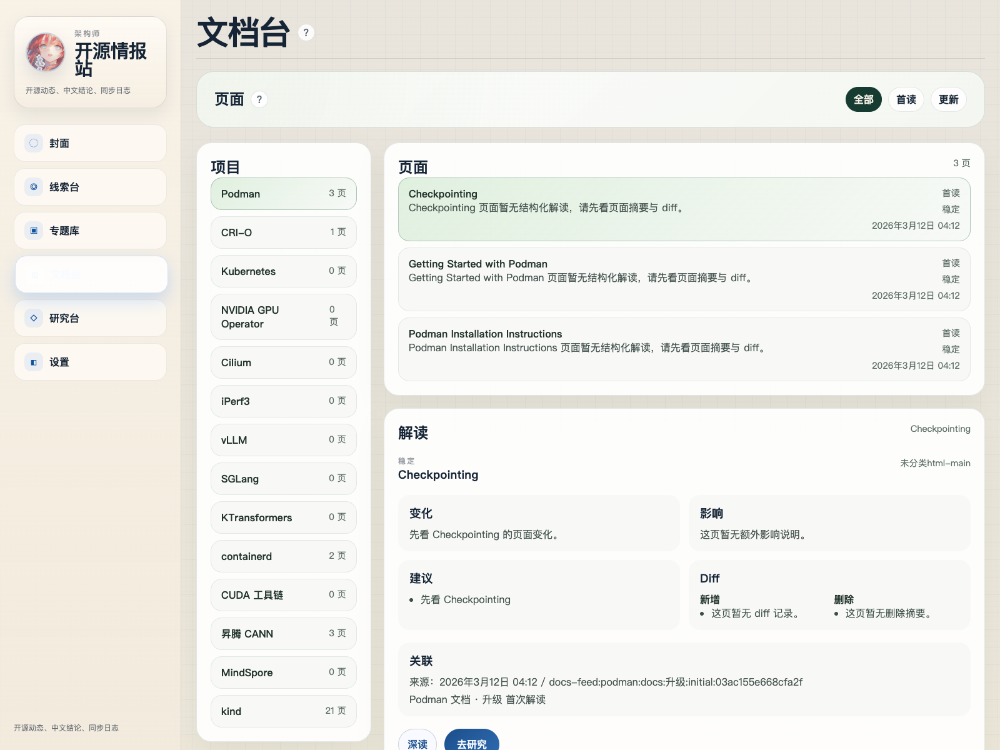

# 架构师开源情报站

一个面向开源项目跟踪的自部署情报站：抓取 GitHub Release 与官方文档变化，生成中文分析、日报、同步日志和研究报告。

## 核心能力

- 增量抓取项目 release 与文档变化
- 只分析新增或变化内容，避免重复重跑
- 把结果沉淀为中文摘要、日报卡片和文档解读
- 用 `Job` 视角查看同步、失败、日志与历史运行
- 用 `项目榜` 持续监控日报项目最近 30 天活跃度
- 通过研究台把实时检索结果和已同步证据合并成报告
- 记录本次调用模型、主备切换和同步链路

## 架构

系统分成 4 条主链路：

1. `同步 Job`
   - 抓取 GitHub Releases 和官方文档
   - 规范化成事件，再交给分析器产出中文结论
2. `日报 Job`
   - 基于项目重要度、更新时间、近 30 天变化和已读衰减排序
   - 生成封面头条、快讯、项目榜和历史归档
3. `文档链路`
   - 支持首读、页面级 diff、单页深读和研究台跳转
4. `LLM 路由`
   - 先做模型探活，再按主路由/备用路由执行
   - 失败时中止任务，不继续白爬
   - 结果里保留 `provider / model / route` 元信息


## 界面




## 快速开始

### 本地启动

```bash
npm install
python3 -m pip install -r requirements.txt
./scripts/start_intel_workbench.sh
```

默认地址：

- 前端：`http://127.0.0.1:5173`
- 后端：`http://127.0.0.1:8000`

停止：

```bash
./scripts/stop_intel_workbench.sh
```

### Docker

```bash
docker compose up --build
```

## 配置

至少准备这几类配置：

- `GITHUB_TOKEN`：提高 GitHub API 抓取稳定性
- `OPENAI_*` 或 `PACKY_*`：模型网关、API Key、模型名、协议
- 设置页里的项目配置：项目地址、日报分区、排序参数、模型主备路由

当前系统支持：

- 主备模型路由
- 失败前探活
- 日报分区窗口配置
- 排序参数可视化调节

## 测试

```bash
npm test
python3 -m pytest -q
npm run build
```

## 目录

- `backend/`：抓取、分析、日报、API
- `src/`：封面、线索台、文档台、研究台、设置页
- `docs/assets/`：README 截图与架构图
- `scripts/`：本地启动、E2E、截图脚本
